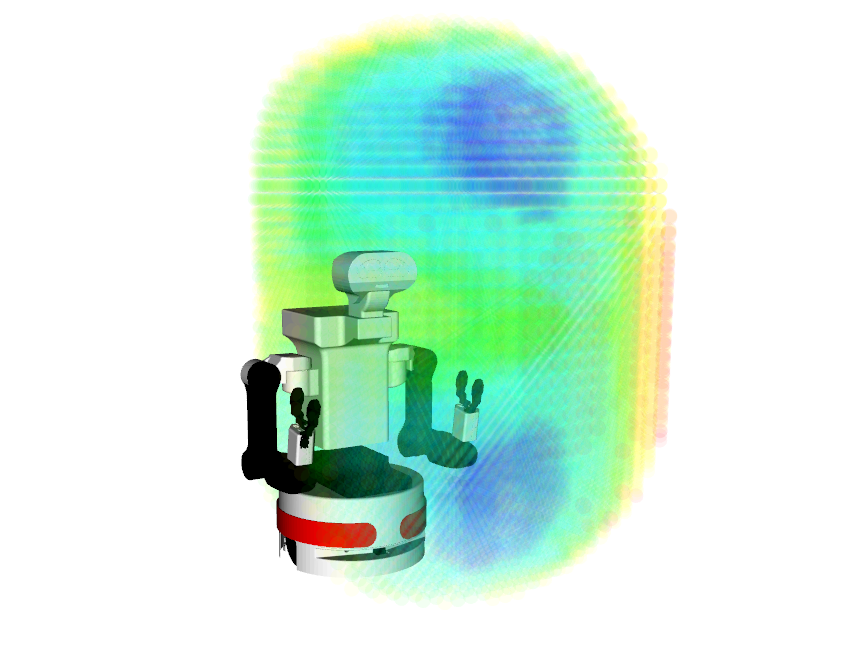
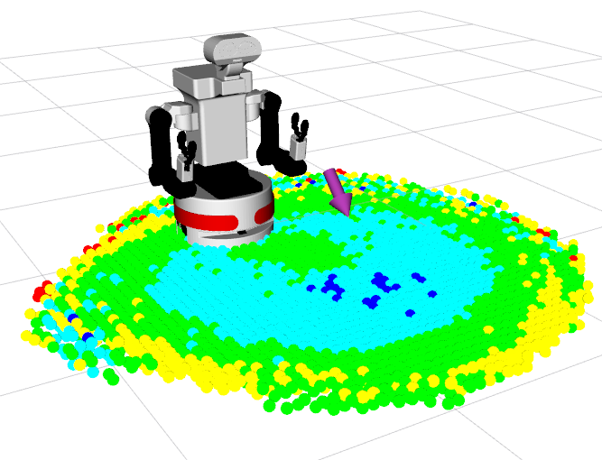

# Sampled Reachability Maps
Reachability and Base Placement maps based on pytorch_kinematics (https://github.com/UM-ARM-Lab/pytorch_kinematics).

This repository is a part of the codebase of the paper: **Robot Learning of Mobile Manipulation With Reachability Behavior Priors** [1] [[Paper](https://arxiv.org/abs/2203.04051)] [[Project site](https://irosalab.com/rlmmbp/)]

  
  

# Usage
Clone repository somewhere, then `pip3 install -e .` to install in editable mode.

See `scripts` for samples. The samples create reachability maps for a Tiago++ mobile manipulator.

- Reachability maps can be created by either sampling joint positions and using forward kinematics (recommended) or by sampling end-effector poses and computing inverse kinematics (much slower)
- The script `invert_reachability_map.py` inverts the reachability map i.e. computes the inverse transform of all the end-effector poses
- The base placement map can then be obtained by transforming the inverted map based on a given goal pose and slicing the map to intersect with the ground (`create_base_placement_map_for_goal_pose.py`)
- For a detailed explanation on the computation of these maps, refer to Vahrenkamp et al. [2] (https://doi.org/10.1109/ICRA.2013.6630839)
- For an alternative, learned base placement map technique, refer to Jauhri at al. [1] (https://doi.org/10.1109/LRA.2022.3188109)

## Credits
- `pytorch_kinematics/transforms` is extracted from [pytorch3d](https://github.com/facebookresearch/pytorch3d) with minor extensions.
This was done instead of including `pytorch3d` as a dependency because it is hard to install and most of its code is unrelated.
  An important difference is that we use left hand multiplied transforms as is convention in robotics (T * pt) instead of their
  right hand multiplied transforms.
- `pytorch_kinematics/urdf_parser_py`, and `pytorch_kinematics/mjcf_parser` is extracted from [kinpy](https://github.com/neka-nat/kinpy), as well as the FK logic.
- `pytorch_kinematics` (https://github.com/UM-ARM-Lab/pytorch_kinematics)
This repository contains add-ons, extensions and bug-fixes on top of pytorch_kinematics.

## References
[1] S. Jauhri, J. Peters and G. Chalvatzaki, "Robot Learning of Mobile Manipulation With Reachability Behavior Priors", https://doi.org/10.1109/LRA.2022.3188109

[2] N. Vahrenkamp, T. Asfour and R. Dillmann, "Robot placement based on reachability inversion," 2013 IEEE International Conference on Robotics and Automation, 2013, pp. 1970-1975, https://doi.org/10.1109/ICRA.2013.6630839.
